# Dead Code Analysis Architecture

This document describes the architecture of the reanalyze dead code analysis pipeline.

## Overview

The DCE (Dead Code Elimination) analysis is structured as a **pure pipeline** with four phases:

1. **MAP** - Process each `.cmt` file independently → per-file data
2. **MERGE** - Combine all per-file data → immutable project-wide view
3. **SOLVE** - Compute dead/live status → immutable result with issues
4. **REPORT** - Output issues (side effects only here)

This design enables:
- **Order independence** - Processing files in any order gives identical results
- **Incremental updates** - Replace one file's data without reprocessing others
- **Testability** - Each phase is independently testable with pure functions
- **Parallelization potential** - Phases 1-3 work on immutable data

---

## Pipeline Diagram

> **Source**: [`diagrams/batch-pipeline.mmd`](diagrams/batch-pipeline.mmd)


---

## Key Data Types

| Type | Purpose | Mutability |
|------|---------|------------|
| `DceFileProcessing.file_data` | Per-file collected data | Builders (mutable during AST walk) |
| `FileAnnotations.t` | Source annotations (`@dead`, `@live`) | Immutable after merge |
| `Declarations.t` | All exported declarations (pos → Decl.t) | Immutable after merge |
| `References.t` | Value/type references (source → targets) | Immutable after merge |
| `FileDeps.t` | Cross-file dependencies (file → FileSet.t) | Immutable after merge |
| `OptionalArgsState.t` | Computed optional arg state per-decl | Immutable |
| `AnalysisResult.t` | Solver output with Issue.t list | Immutable |
| `DceConfig.t` | Analysis configuration | Immutable (passed explicitly) |

---

## Phase Details

### Phase 1: MAP (Per-File Processing)

**Entry point**: `DceFileProcessing.process_cmt_file`

**Input**: `.cmt` file path + `DceConfig.t`

**Output**: `file_data` containing builders for:
- `annotations` - `@dead`, `@live` annotations from source
- `decls` - Exported value/type/exception declarations
- `refs` - References to other declarations
- `file_deps` - Which files this file depends on
- `cross_file` - Items needing cross-file resolution (optional args, exceptions)

**Key property**: Local mutable state is OK here (performance). Each file is processed independently.

### Phase 2: MERGE (Combine Builders)

**Entry point**: `Reanalyze.runAnalysis` (merge section)

**Input**: `file_data list`

**Output**: Immutable project-wide data structures

**Operations**:
```ocaml
let annotations = FileAnnotations.merge_all (file_data_list |> List.map (fun fd -> fd.annotations))
let decls = Declarations.merge_all (file_data_list |> List.map (fun fd -> fd.decls))
let refs = References.merge_all (file_data_list |> List.map (fun fd -> fd.refs))
let file_deps = FileDeps.merge_all (file_data_list |> List.map (fun fd -> fd.file_deps))
```

**Key property**: Merge operations are commutative - order of `file_data_list` doesn't matter.

### Phase 3: SOLVE (Deadness Computation)

**Entry point**: `DeadCommon.solveDead` + optional args second pass in `Reanalyze.runAnalysis`

**Input**: All merged data + config

**Output**: `AnalysisResult.t` containing `Issue.t list`

**Algorithm** (forward fixpoint + liveness-aware optional args):

**Core liveness computation** (`Liveness.compute_forward`):
1. Identify roots: declarations with `@live`/`@genType` annotations or referenced from outside any declaration
2. Build index mapping each declaration to its outgoing references (refs_from direction)
3. Run forward fixpoint: propagate liveness from roots through references
4. Return set of all live positions

**Pass 1: Deadness resolution**
1. Compute liveness via forward propagation
2. For each declaration, check if in live set
3. Mark dead declarations, collect issues

**Pass 2: Liveness-aware optional args analysis**
1. Use `Decl.isLive` to build an `is_live` predicate from Pass 1 results
2. Compute optional args state via `CrossFileItems.compute_optional_args_state`, filtering out calls from dead code
3. Collect optional args issues only for live declarations
4. Merge optional args issues into the final result

This two-pass approach ensures that optional argument warnings (e.g., "argument X is never used") only consider calls from live code, preventing false positives when a function is only called from dead code.

**Key property**: Pure functions - immutable in, immutable out. No side effects.

### Phase 4: REPORT (Output)

**Entry point**: `Reanalyze.runAnalysis` (report section)

**Input**: `AnalysisResult.t`

**Output**: Logging / JSON to stdout

**Operations**:
```ocaml
AnalysisResult.get_issues analysis_result
|> List.iter (fun issue -> Log_.warning ~loc:issue.loc issue.description)
```

**Key property**: All side effects live here at the edge. The solver never logs directly.

---

## Incremental Updates (Future)

The architecture enables incremental updates when a file changes:

1. Re-run Phase 1 for changed file only → new `file_data`
2. Replace in `file_data` map (keyed by filename)
3. Re-run Phase 2 (merge) - fast, pure function
4. Re-run Phase 3 (solve) - fast, pure function

The key insight: **immutable data structures enable safe incremental updates** - you can swap one file's data without affecting others.

---

## Reactive Pipelines

The reactive layer (`analysis/reactive/`) provides delta-based incremental updates. Instead of re-running entire phases, changes propagate automatically through derived collections.

### Core Reactive Primitives

| Primitive | Description |
|-----------|-------------|
| `Reactive.t ('k, 'v)` | Universal reactive collection interface |
| `subscribe` | Register for delta notifications |
| `iter` | Iterate current entries |
| `get` | Lookup by key |
| `delta` | Change notification: `Set (key, value)` or `Remove key` |
| `flatMap` | Transform collection, optionally merge same-key values |
| `join` | Hash join two collections (left join behavior) |
| `union` | Combine two collections, optionally merge same-key values |
| `fixpoint` | Transitive closure: `init + edges → reachable` |
| `lookup` | Single-key subscription |
| `ReactiveFileCollection` | File-backed collection with change detection |

### Fully Reactive Analysis Pipeline

The reactive pipeline computes issues directly from source files with **zero recomputation on cache hits**:

```
Files → file_data → decls, annotations, refs → live (fixpoint) → dead_decls → issues → REPORT
         ↓              ↓                          ↓                ↓           ↓        ↓
     ReactiveFile   ReactiveMerge          ReactiveLiveness   ReactiveSolver         iter
     Collection         (flatMap)              (fixpoint)      (join+join)         (only)
```

**Key property**: When no files change, no computation happens. All reactive collections are stable. Only the final `collect_issues` call iterates (O(issues)).

### Pipeline Stages

| Stage | Input | Output | Combinator |
|-------|-------|--------|------------|
| **File Processing** | `.cmt` files | `file_data` | `ReactiveFileCollection` |
| **Merge** | `file_data` | `decls`, `annotations`, `refs` | `flatMap` |
| **Liveness** | `refs`, `annotations` | `live` (positions) | `fixpoint` |
| **Dead Decls** | `decls`, `live` | `dead_decls` | `join` (left-join, filter `None`: decls where NOT in live) |
| **Issues** | `dead_decls`, `annotations` | `issues` | `join` (filter by annotation, generate Issue.t) |
| **Report** | `issues` | stdout | `iter` (ONLY iteration in entire pipeline) |

**Note**: Optional args analysis (unused/redundant arguments) is not yet in the reactive pipeline - it still uses the non-reactive path. TODO: Add `live_decls + cross_file_items → optional_args_issues` to the reactive pipeline.

### Reactive Pipeline Diagram

> **Source**: [`diagrams/reactive-pipeline.mmd`](diagrams/reactive-pipeline.mmd)



```
┌─────────────────────────────────────────────────────────────────────────────┐
│                         REACTIVE ANALYSIS PIPELINE                          │
│                                                                             │
│  ┌──────────┐                                                               │
│  │  .cmt    │                                                               │
│  │  files   │                                                               │
│  └────┬─────┘                                                               │
│       │                                                                     │
│       ▼                                                                     │
│  ┌──────────────────────┐                                                   │
│  │ ReactiveFileCollection│  File change detection + caching                 │
│  │      file_data        │                                                  │
│  └────┬─────────────────┘                                                   │
│       │ flatMap                                                             │
│       ▼                                                                     │
│  ┌──────────────────────┐                                                   │
│  │    ReactiveMerge     │  Derives collections from file_data               │
│  │ ┌──────┐ ┌────────┐  │                                                   │
│  │ │decls │ │  refs  │  │                                                   │
│  │ └──┬───┘ └───┬────┘  │                                                   │
│  │    │  ┌──────┴─────┐ │                                                   │
│  │    │  │annotations │ │                                                   │
│  │    │  └──────┬─────┘ │                                                   │
│  └────┼─────────┼───────┘                                                   │
│       │         │                                                           │
│       │         ▼                                                           │
│       │    ┌─────────────────────┐                                          │
│       │    │  ReactiveLiveness   │  roots + edges → live (fixpoint)         │
│       │    │  ┌──────┐ ┌──────┐  │                                          │
│       │    │  │roots │→│ live │  │                                          │
│       │    │  └──────┘ └──┬───┘  │                                          │
│       │    └──────────────┼──────┘                                          │
│       │                   │                                                 │
│       ▼                   ▼                                                 │
│  ┌─────────────────────────────────┐                                        │
│  │        ReactiveSolver           │  Pure reactive joins (NO iteration)    │
│  │                                 │                                        │
│  │  decls ──┬──► dead_decls ──┬──► issues                                   │
│  │          │        ↑        │       ↑                                     │
│  │  live ───┘  (join, keep    │  (join with annotations)                    │
│  │             if NOT in live)│                                             │
│  │  annotations ──────────────┘                                             │
│  │                                 │                                        │
│  │  (Optional args: TODO - not yet reactive)                                │
│  └─────────────────────────────────┘                                        │
│                   │                                                         │
│                   ▼                                                         │
│  ┌─────────────────────────────────┐                                        │
│  │           REPORT                │  ONLY iteration: O(issues)             │
│  │   collect_issues → Log_.warning │  (linear in number of issues)          │
│  └─────────────────────────────────┘                                        │
│                                                                             │
└─────────────────────────────────────────────────────────────────────────────┘
```

### Delta Propagation

When a file changes:

1. `ReactiveFileCollection` detects change, emits delta for `file_data`
2. `ReactiveMerge` receives delta, updates `decls`, `refs`, `annotations`
3. `ReactiveLiveness` receives delta, updates `live` set via incremental fixpoint
4. `ReactiveSolver` receives delta, updates `dead_decls` and `issues` via reactive joins
5. **Only affected entries are recomputed** - untouched entries remain stable

When no files change:
- **Zero computation** - all reactive collections are stable
- Only `collect_issues` iterates (O(issues)) - this is the ONLY iteration in the entire pipeline
- Reporting is linear in the number of issues

### Performance Characteristics

| Scenario | Solving | Reporting | Total |
|----------|---------|-----------|-------|
| Cold start (4900 files) | ~2ms | ~3ms | ~7.7s |
| Cache hit (0 files changed) | ~1-5ms | ~3-8ms | ~30ms |
| Single file change | O(affected_decls) | O(issues) | minimal |

**Key insight**: On cache hit, `Solving` time is just iterating the reactive `issues` collection.
No joins are recomputed, no fixpoints are re-run - the reactive collections are stable.

### Reactive Modules

| Module | Responsibility |
|--------|---------------|
| `Reactive` | Core primitives: `flatMap`, `join`, `union`, `fixpoint`, delta types |
| `ReactiveFileCollection` | File-backed collection with change detection |
| `ReactiveAnalysis` | CMT processing with file caching |
| `ReactiveMerge` | Derives decls, annotations, refs from file_data |
| `ReactiveTypeDeps` | Type-label dependency resolution |
| `ReactiveExceptionRefs` | Exception ref resolution via join |
| `ReactiveDeclRefs` | Maps declarations to their outgoing references |
| `ReactiveLiveness` | Computes live positions via reactive fixpoint |
| `ReactiveSolver` | Computes dead_decls and issues via reactive joins |

---

## Testing

**Order-independence test**: Run with `-test-shuffle` flag to randomize file processing order. The test (`make test-reanalyze-order-independence`) verifies that shuffled runs produce identical output.

**Unit testing**: Each phase can be tested independently:
- Phase 1: Process a single `.cmt` file, verify `file_data`
- Phase 2: Merge known builders, verify merged result
- Phase 3: Call solver with known inputs, verify issues

---

## Key Modules

| Module | Responsibility |
|--------|---------------|
| `Reanalyze` | Entry point, orchestrates pipeline |
| `DceFileProcessing` | Phase 1: Per-file AST processing |
| `DceConfig` | Configuration (CLI flags + run config) |
| `DeadCommon` | Phase 3: Solver (`solveDead`, `solveDeadReactive`) |
| `Liveness` | Forward fixpoint liveness computation |
| `Declarations` | Declaration storage (builder/immutable) |
| `References` | Reference tracking (source → targets) |
| `FileAnnotations` | Source annotation tracking |
| `FileDeps` | Cross-file dependency graph |
| `CrossFileItems` | Cross-file optional args and exceptions |
| `AnalysisResult` | Immutable solver output |
| `Issue` | Issue type definitions |
| `Log_` | Phase 4: Logging output |
| `ReactiveSolver` | Reactive dead_decls → issues computation |

