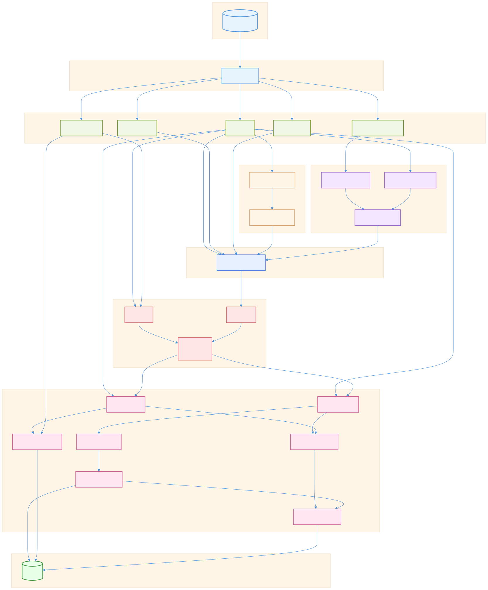

# Dead Code Analysis Architecture

This document describes the architecture of the reanalyze dead code analysis pipeline.

## Overview

The DCE (Dead Code Elimination) analysis runs in four phases over one reactive
pipeline (`Dce_pipeline.t`):

1. **MAP** - Process each `.cmt` file independently → per-file data
2. **MERGE** - Derive project-wide collections from the per-file data
3. **SOLVE** - Compute dead/live status → issues
4. **REPORT** - Output issues (side effects only here)

This design gives:
- **Order independence** - Processing files in any order gives identical results
- **Incremental updates** - Adding, changing or removing one file updates only the derived entries it affects
- **Testability** - Each phase consumes and produces plain data

---

## Key Data Types

| Type | Purpose | Mutability |
|------|---------|------------|
| `Dce_file_processing.file_data` | Per-file collected data | Builders (mutable during AST walk) |
| `Reactive_merge.t` | Project-wide decls, annotations, refs, cross-file items, file deps | Reactive collections |
| `Annotation_store.t` | Source annotations (`@dead`, `@live`, `@genType`) read by the solver | Read-only view of a reactive collection |
| `Cross_file_items_store.t` | Optional-arg calls, function refs and value escapes | Read-only view of a reactive collection |
| `Optional_args_state.t` | Computed optional arg state per-decl | Built once per solve |
| `Analysis_result.t` | Issue list handed to reporting | Immutable |
| `Dce_config.t` | Analysis configuration | Immutable (passed explicitly) |

---

## Phase Details

### Phase 1: MAP (Per-File Processing)

**Entry point**: `Dce_file_processing.process_cmt_file`, called per file by
`Reactive_analysis.process_files`

**Input**: `.cmt` file path + `Dce_config.t`

**Output**: `file_data` containing builders for:
- `annotations` - `@dead`, `@live`, `@genType` annotations from source
- `decls` - Exported value/type/exception declarations
- `refs` - References to other declarations
- `file_deps` - Which files this file depends on
- `cross_file` - Items needing cross-file resolution (optional args, exceptions)

**Key property**: Local mutable state is OK here (performance). Each file is processed independently. `Reactive_file_collection` caches the result per file and reprocesses only files whose `.cmt` changed.

### Phase 2: MERGE (Project-Wide Collections)

**Entry point**: `Reactive_merge.create`

**Input**: the reactive collection of `(path, file_data)`

**Output**: `Reactive_merge.t`, whose collections (`decls`, `annotations`,
`value_refs_from`, `type_refs_from`, `cross_file_items`, `file_deps_map`,
`files`) are `flat_map`s over the per-file data, plus the type-dependency,
exception-reference and coercion collections derived from them.

**Key property**: Each merged collection is keyed by position or file, so the result does not depend on the order files arrive in.

### Phase 3: SOLVE (Deadness Computation)

**Entry point**: `Reanalyze.run_analysis` (solving section): `Reactive_solver.collect_issues`, then the optional args pass

**Input**: The merged collections + config

**Output**: `Analysis_result.t` containing `Issue.t list`

**Algorithm** (forward fixpoint + liveness-aware optional args):

**Core liveness computation** (`Reactive_liveness.create`):
1. Identify roots: declarations with `@live`/`@genType` annotations or referenced from outside any declaration
2. Build the edges mapping each declaration to its outgoing references (`Reactive_decl_refs`)
3. Run a reactive fixpoint: propagate liveness from roots through edges
4. The `live` collection holds all live positions

**Pass 1: Deadness resolution** (`Reactive_solver`)
1. Partition declarations into `dead_decls` and `live_decls` by joining with `live`
2. Group dead declarations per file and generate issues per file (`Dead_common.report_declaration`)
3. Derive dead-module issues and incorrect `@dead` annotations

**Pass 2: Liveness-aware optional args analysis** (`Reanalyze.run_analysis`)
1. Use `Reactive_solver.is_pos_live` as the `is_live` predicate
2. Compute optional args state via `Cross_file_items_store.compute_optional_args_state`, filtering out calls from dead code
3. Run `Dead_optional_args.check` on each live declaration (`Reactive_solver.iter_live_decls`)
4. Append optional args issues to the dead code issues

This two-pass approach ensures that optional argument warnings (e.g., "argument X is never used") only consider calls from live code, preventing false positives when a function is only called from dead code.

**Key property**: The solver returns issues; it never logs directly.

### Phase 4: REPORT (Output)

**Entry point**: `Reanalyze.run_analysis` (report section)

**Input**: `Analysis_result.t`

**Output**: Logging / JSON to stdout

**Operations**:
```ocaml
Analysis_result.get_issues result
|> List.iter (fun (issue : Issue.t) ->
    Log_.warning ~loc:issue.loc issue.description)
```

**Key property**: All side effects live here at the edge.

---

## Reactive Pipelines

The reactive layer (`analysis/reactive/`) provides delta-based incremental updates. Instead of re-running entire phases, changes propagate automatically through derived collections.

### Core Reactive Primitives

| Primitive | Description |
|-----------|-------------|
| `('k, 'v) Reactive.t` | Universal reactive collection interface |
| `subscribe` | Register for delta notifications |
| `iter` | Iterate current entries |
| `get` | Lookup by key |
| `delta` | Change notification: `Set (k, v)`, `Remove k`, or `Batch [(k, v option); ...]` |
| `source` | Create a mutable source collection with emit function |
| `flat_map` | Transform collection, optionally merge same-key values |
| `join` | Hash join two collections (left join behavior) |
| `union` | Combine two collections, optionally merge same-key values |
| `fixpoint` | Transitive closure: `init + edges → reachable` |
| `Reactive_file_collection` | File-backed collection with change detection |

### Glitch-Free Semantics via Topological Scheduling

The reactive system implements **glitch-free propagation** using an accumulate-then-propagate scheduler. This ensures derived collections always see consistent parent states, similar to SKStore's approach.

**How it works:**
1. Each node has a `level` (topological order):
   - Source collections have `level = 0`
   - Derived collections have `level = max(parent levels) + 1`
2. Each combinator **accumulates** incoming deltas in pending buffers
3. The scheduler visits dirty nodes in level order and calls `process()`
4. Each node processes **once per wave** with complete input from all parents

**Example ordering:**
```
file_collection (L0) → file_data (L1) → decls (L2) → live (L14) → dead_decls (L15)
```

When a batch of file changes arrives:
1. Deltas accumulate in pending buffers (no immediate processing)
2. Scheduler processes level 0, then level 1, etc.
3. A join processes only after **both** parents have updated

The `Reactive.Registry` and `Reactive.Scheduler` modules provide:
- Named nodes with stats tracking (use `-timing` flag to see stats)
- `Reactive.to_mermaid ()` - Generate pipeline diagram (use `-mermaid` flag)
- `Reactive.print_stats ()` - Show per-node timing and delta counts

### Fully Reactive Analysis Pipeline

The reactive pipeline computes issues directly from source files with **zero recomputation on cache hits**:

```
Files → file_data → decls, annotations, refs → live (fixpoint) → dead/live_decls → issues → REPORT
         ↓              ↓                          ↓                    ↓              ↓        ↓
 Reactive_file_   Reactive_merge          Reactive_liveness     Reactive_solver           iter
   collection       (flat_map)               (fixpoint)        (multiple joins)          (only)
```

**Key property**: When no files change, no computation happens. All reactive collections are stable. Only the final `collect_issues` call iterates pre-computed collections (O(issues)).

### Pipeline Stages

| Stage | Input | Output | Combinator |
|-------|-------|--------|------------|
| **File Processing** | `.cmt` files | `file_data` | `Reactive_file_collection` |
| **Merge** | `file_data` | `decls`, `annotations`, `refs` | `flat_map` |
| **Liveness** | `refs`, `annotations` | `live` (positions) | `fixpoint` |
| **Dead/Live Partition** | `decls`, `live` | `dead_decls`, `live_decls` | `join` (partition by liveness) |
| **Dead Modules** | `dead_decls`, `live_decls` | `dead_modules` | `flat_map` + `join` (anti-join) |
| **Per-File Grouping** | `dead_decls` | `dead_decls_by_file` | `flat_map` with merge |
| **Per-File Issues** | `dead_decls_by_file`, `annotations` | `issues_by_file` | `flat_map` (sort + filter + generate) |
| **Incorrect @dead** | `live_decls`, `annotations` | `incorrect_dead_decls` | `join` (live with Dead annotation) |
| **Module Issues** | `dead_modules`, `issues_by_file` | `dead_module_issues` | `flat_map` + `join` |
| **Report** | all issue collections | stdout | `iter` (ONLY iteration) |

### Reactive_solver Collections

| Collection | Type | Description |
|------------|------|-------------|
| `dead_decls` | `(pos, Decl.t)` | Declarations NOT in live set |
| `live_decls` | `(pos, Decl.t)` | Declarations IN live set |
| `dead_modules` | `(Name.t, Location.t * string)` | Modules with only dead declarations (anti-join) |
| `dead_decls_by_file` | `(file, Decl.t list)` | Dead decls grouped by file |
| `issues_by_file` | `(file, Issue.t list * Name.t list)` | Per-file issues + reported modules |
| `incorrect_dead_decls` | `(pos, Decl.t)` | Live decls with @dead annotation |
| `dead_module_issues` | `(Name.t, Issue.t)` | Module issues (join of dead_modules + modules_with_reported) |

In non-transitive mode (`-no-transitive`), per-file issue generation also reads `value_refs_from` for the `has_ref_below` check.

**Note**: Optional args analysis (unused/redundant arguments) is computed after the solver settles, by iterating live declarations; it is not a reactive collection.

### Reactive Pipeline Diagram

> **Source**: [`diagrams/reactive-pipeline.mmd`](diagrams/reactive-pipeline.mmd)



This is a high-level view (~25 nodes). See also the [full detailed diagram source](diagrams/reactive-pipeline-full.mmd) with all 44 nodes (auto-generated via `-mermaid` flag).

Key stages:

1. **File Layer**: `file_collection` → `file_data` → extracted collections
2. **TypeDeps** (`Reactive_type_deps`): `decl_by_path` → interface/implementation refs → `all_type_refs`
3. **ExceptionRefs** (`Reactive_exception_refs`): `cross_file` → `resolved_refs` → `resolved_from`
4. **DeclRefs** (`Reactive_decl_refs`): Combines value/type refs → `combined` edges
5. **Liveness** (`Reactive_liveness`): `annotated_roots` + `externally_referenced` → `all_roots` + `edges` → `live` (fixpoint)
6. **Solver** (`Reactive_solver`): `decls` + `live` → `dead_decls`/`live_decls` → per-file issues → module issues

Use `-mermaid` flag to generate the current pipeline diagram from code.

### Delta Propagation

When a file changes:

1. `Reactive_file_collection` detects change, emits delta for `file_data`
2. `Reactive_merge` receives delta, updates `decls`, `refs`, `annotations`
3. `Reactive_liveness` receives delta, updates `live` set via incremental fixpoint
4. `Reactive_solver` receives delta, updates `dead_decls` and `issues` via reactive joins
5. **Only affected entries are recomputed** - untouched entries remain stable

When no files change:
- **Zero computation** - all reactive collections are stable
- Only `collect_issues` iterates (O(issues)) - this is the ONLY iteration in the entire pipeline
- Reporting is linear in the number of issues

### Performance Characteristics

| Scenario | Solving | Reporting | Total |
|----------|---------|-----------|-------|
| Cold start (4900 files) | ~2ms | ~3ms | ~7.7s |
| Cache hit (0 files changed) | ~1-5ms | ~3-8ms | ~30ms |
| Single file change | O(affected_decls) | O(issues) | minimal |

**Key insight**: On cache hit, `Solving` time is just iterating the reactive `issues` collection.
No joins are recomputed, no fixpoints are re-run - the reactive collections are stable.

### Reactive Modules

| Module | Responsibility |
|--------|---------------|
| `Reactive` | Core primitives: `source`, `flat_map`, `join`, `union`, `fixpoint`, `Scheduler`, `Registry` |
| `Reactive_file_collection` | File-backed collection with change detection |
| `Reactive_analysis` | CMT processing with file caching |
| `Reactive_merge` | Derives decls, annotations, refs from file_data |
| `Reactive_type_deps` | Type-label dependency resolution |
| `Reactive_exception_refs` | Exception ref resolution via join |
| `Reactive_coercions` | References induced by type coercions |
| `Reactive_decl_refs` | Maps declarations to their outgoing references |
| `Reactive_liveness` | Computes live positions via reactive fixpoint |
| `Reactive_solver` | Computes dead_decls and issues via reactive joins |

### Stats Tracking

Use `-timing` flag to see per-node statistics:

| Stat | Description |
|------|-------------|
| `d_recv` | Deltas received (Set/Remove/Batch messages) |
| `e_recv` | Entries received (after batch expansion) |
| `+in` / `-in` | Adds/removes received from upstream |
| `d_emit` | Deltas emitted downstream |
| `e_emit` | Entries in emitted deltas |
| `+out` / `-out` | Adds/removes emitted (non-zero `-out` indicates churn) |
| `runs` | Times the node's `process()` was called |
| `time_ms` | Cumulative processing time |

---

## Testing

**Order-independence test**: Run with `-test-shuffle` flag to randomize file processing order. The test (`make -C tests/analysis_tests/tests-reanalyze/deadcode test-reanalyze-order-independence`) verifies that shuffled runs produce identical output.

---

## Key Modules

| Module | Responsibility |
|--------|---------------|
| `Reanalyze` | Entry point, orchestrates pipeline |
| `Dce_pipeline` | Creates the reactive collection, merge, liveness and solver |
| `Dce_file_processing` | Phase 1: Per-file AST processing |
| `Dce_config` | Configuration (CLI flags + run config) |
| `Dead_common` | Declaration and reference recording, per-declaration issue reporting (`report_declaration`) |
| `Dead_optional_args` | Optional-argument issues for a live declaration |
| `Declarations` | Per-file declaration builder |
| `References` | Per-file reference builder (source → targets) |
| `File_annotations` | Per-file source annotation builder |
| `File_deps` | Per-file dependency builder |
| `Cross_file_items` | Cross-file optional args and exceptions |
| `Analysis_result` | Issue list handed to reporting |
| `Issue` | Issue type definitions |
| `Log_` | Phase 4: Logging output |
